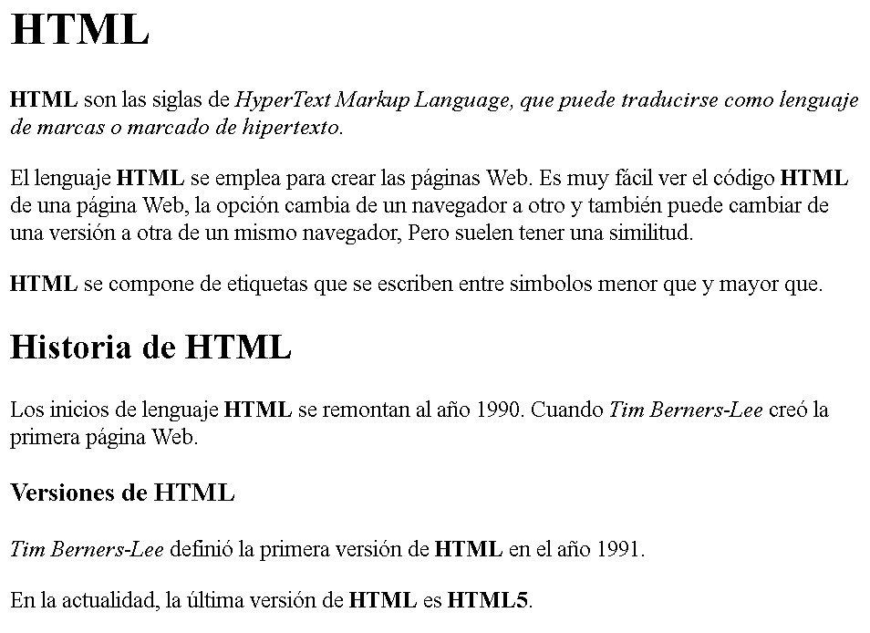
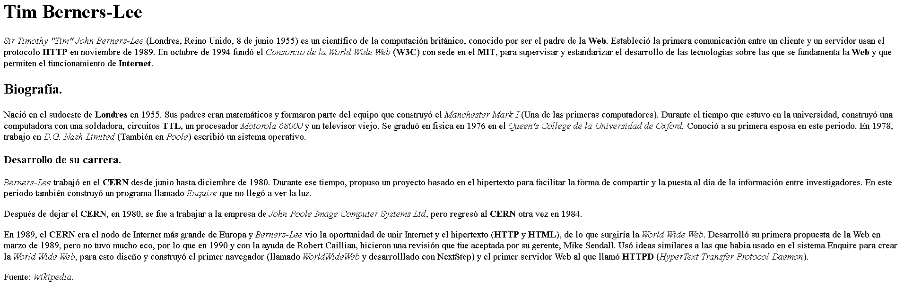

# HTML

## Historia práctica.

 

1. Realice un documento `HTML`, en base a la siguiente imagen:

Las etiquetas utilizadas son las siguientes: `h1`, `h2`, `h3`, `p`, `i` y `b`.

2. Realice un documento `HTML`, en base a la siguiente imagen:

Las etiquetas utilizadas son las siguientes: `h1`, `h2`, `h3`, `p`, `i` y `b`.
 

> Visita la primera página Web de la historia:<a href="http://info.cern.ch/hypertext/WWW/TheProject.html" _blank >Haz clic Aquí</a>
